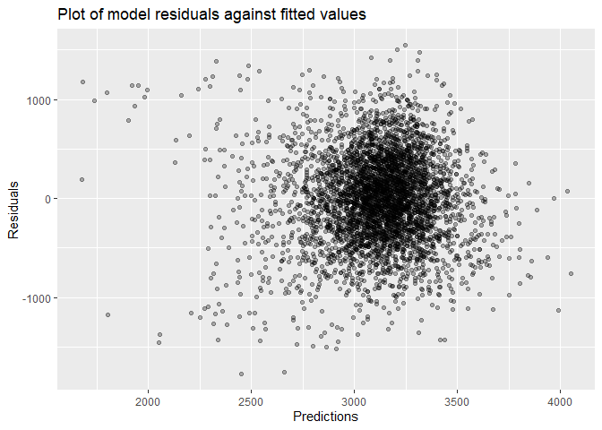
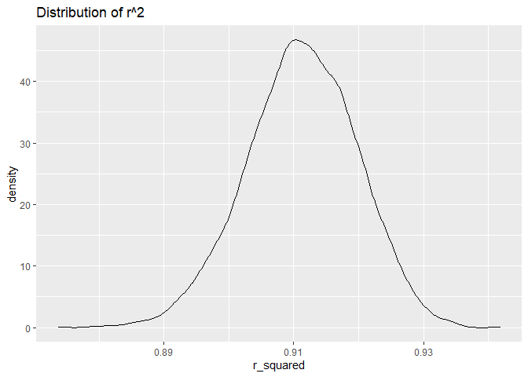
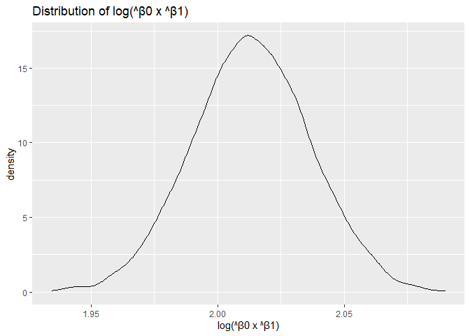

HW6
================
Liner Ge
2020/12/4

``` r
library(tidyverse)
```

    ## -- Attaching packages ------------------------------------ tidyverse 1.3.0 --

    ## √ ggplot2 3.3.2     √ purrr   0.3.4
    ## √ tibble  3.0.3     √ dplyr   1.0.2
    ## √ tidyr   1.1.2     √ stringr 1.4.0
    ## √ readr   1.3.1     √ forcats 0.5.0

    ## Warning: package 'dplyr' was built under R version 4.0.3

    ## -- Conflicts --------------------------------------- tidyverse_conflicts() --
    ## x dplyr::filter() masks stats::filter()
    ## x dplyr::lag()    masks stats::lag()

``` r
library(readxl)
library(patchwork)
library(modelr)
library(mgcv)
```

    ## Loading required package: nlme

    ## 
    ## Attaching package: 'nlme'

    ## The following object is masked from 'package:dplyr':
    ## 
    ##     collapse

    ## This is mgcv 1.8-33. For overview type 'help("mgcv-package")'.

``` r
set.seed(1)
```

# Problem 1

read in data

``` r
homicide_df =
  read_csv("./data/homicide-data.csv", na = c("", "NA", "Unknown")) %>% 
  mutate(
    city_state = str_c(city, state, sep = ", "),
    victim_age = as.numeric(victim_age),
    resolution = case_when(
      disposition == "Closed without arrest" ~ 0,
      disposition == "Open/No arrest"        ~ 0,
      disposition == "Closed by arrest"      ~ 1)
  ) %>% 
  filter(
    victim_race %in% c("White", "Black"),
    city_state != "Tulsa, AL") %>% 
  select(city_state, resolution, victim_age, victim_race, victim_sex)
```

    ## Parsed with column specification:
    ## cols(
    ##   uid = col_character(),
    ##   reported_date = col_double(),
    ##   victim_last = col_character(),
    ##   victim_first = col_character(),
    ##   victim_race = col_character(),
    ##   victim_age = col_double(),
    ##   victim_sex = col_character(),
    ##   city = col_character(),
    ##   state = col_character(),
    ##   lat = col_double(),
    ##   lon = col_double(),
    ##   disposition = col_character()
    ## )

Try this across cities

``` r
models_results_df =
  homicide_df %>% 
  nest(data = -city_state) %>% 
  mutate(
    models = 
      map(.x = data, ~glm(resolution ~ victim_age + victim_race + victim_sex, data = .x, family = binomial())),
    results = map(models, broom::tidy)
    ) %>% 
  select(city_state, results) %>% 
  unnest(results) %>% 
  mutate(
    OR = exp(estimate), # odds ratio
    CI_lower = exp(estimate - 1.96 * std.error),
    CI_upper = exp(estimate + 1.96 * std.error)
  ) %>% 
  select(city_state, term, OR, starts_with("CI"))
```

``` r
models_results_df %>% 
  filter(term == "victim_sexMale") %>% 
  mutate(city_state = fct_reorder(city_state, OR)) %>% 
  ggplot(aes(x = city_state, y = OR)) +
  geom_point() +
  geom_errorbar(aes(ymin = CI_lower, ymax = CI_upper)) +
  theme(axis.text.x = element_text(angle = 90, vjust = 0.5, hjust = 1))
```

<!-- -->

# Problem 2

## read in and tidy the data

``` r
birtnweight_df = 
  read.csv("./data/birthweight.csv") %>% 
  janitor::clean_names() %>%
  filter(frace != 9) %>% 
  drop_na() %>% 
  mutate(
    babysex = case_when(
      babysex == 1 ~ "male",
      babysex == 2 ~ "female"
    ),
    frace = case_when(
      frace == 1 ~ "White",
      frace == 2 ~ "Black",
      frace == 3 ~ "Asian",
      frace == 4 ~ "Puerto Rican",
      frace == 8 ~ "Other"
    ),
    mrace = case_when(
      mrace == 1 ~ "White",
      mrace == 2 ~ "Black",
      mrace == 3 ~ "Asian",
      mrace == 4 ~ "Puerto Rican",
      mrace == 8 ~ "Other"
    ),
    malform = case_when(
      malform == 0 ~ "absent",
      malform == 1 ~ "present"
    ),
    across(where(is.character), as.factor)
    )
```

    ## Warning in FUN(X[[i]], ...): strings not representable in native encoding will
    ## be translated to UTF-8

    ## Warning in FUN(X[[i]], ...): unable to translate '<U+00C4>' to native encoding

    ## Warning in FUN(X[[i]], ...): unable to translate '<U+00D6>' to native encoding

    ## Warning in FUN(X[[i]], ...): unable to translate '<U+00E4>' to native encoding

    ## Warning in FUN(X[[i]], ...): unable to translate '<U+00F6>' to native encoding

    ## Warning in FUN(X[[i]], ...): unable to translate '<U+00DF>' to native encoding

    ## Warning in FUN(X[[i]], ...): unable to translate '<U+00C6>' to native encoding

    ## Warning in FUN(X[[i]], ...): unable to translate '<U+00E6>' to native encoding

    ## Warning in FUN(X[[i]], ...): unable to translate '<U+00D8>' to native encoding

    ## Warning in FUN(X[[i]], ...): unable to translate '<U+00F8>' to native encoding

    ## Warning in FUN(X[[i]], ...): unable to translate '<U+00C5>' to native encoding

    ## Warning in FUN(X[[i]], ...): unable to translate '<U+00E5>' to native encoding

## Model selection

``` r
birtnweight_df %>% 
  lm(bwt~.,data = .) %>% 
  broom::tidy() %>% 
  knitr::kable(digits = 3)
```

| term              |   estimate | std.error | statistic | p.value |
| :---------------- | ---------: | --------: | --------: | ------: |
| (Intercept)       | \-6306.835 |   659.264 |   \-9.566 |   0.000 |
| babysexmale       |   \-28.707 |     8.465 |   \-3.391 |   0.001 |
| bhead             |    130.778 |     3.452 |    37.881 |   0.000 |
| blength           |     74.954 |     2.022 |    37.075 |   0.000 |
| delwt             |      4.101 |     0.395 |    10.386 |   0.000 |
| fincome           |      0.290 |     0.180 |     1.614 |   0.107 |
| fraceBlack        |    \-6.905 |    78.835 |   \-0.088 |   0.930 |
| fraceOther        |   \-16.939 |    97.593 |   \-0.174 |   0.862 |
| fracePuerto Rican |   \-68.232 |    78.469 |   \-0.870 |   0.385 |
| fraceWhite        |   \-21.236 |    69.296 |   \-0.306 |   0.759 |
| gaweeks           |     11.549 |     1.465 |     7.882 |   0.000 |
| malformpresent    |      9.765 |    70.626 |     0.138 |   0.890 |
| menarche          |    \-3.551 |     2.895 |   \-1.226 |   0.220 |
| mheight           |      9.787 |    10.312 |     0.949 |   0.343 |
| momage            |      0.759 |     1.222 |     0.621 |   0.534 |
| mraceBlack        |   \-60.049 |    80.953 |   \-0.742 |   0.458 |
| mracePuerto Rican |     34.908 |    80.948 |     0.431 |   0.666 |
| mraceWhite        |     91.387 |    71.919 |     1.271 |   0.204 |
| parity            |     95.541 |    40.479 |     2.360 |   0.018 |
| pnumlbw           |         NA |        NA |        NA |      NA |
| pnumsga           |         NA |        NA |        NA |      NA |
| ppbmi             |      4.354 |    14.891 |     0.292 |   0.770 |
| ppwt              |    \-3.472 |     2.612 |   \-1.329 |   0.184 |
| smoken            |    \-4.854 |     0.587 |   \-8.269 |   0.000 |
| wtgain            |         NA |        NA |        NA |      NA |

I assume that baby’s weight is associated with physiological conditions
of his/her mother’ pregnancy. According to the regression model of all
veriable, I would choose variables with p.value smaller than 0.05. Thus,
I choose mother’s age at delivery `momage`, mother’s weight gain during
pregnancy `wtgain`, gestational age in weeks`gaweeks`, number of live
births prior to this pregnancy`parity` as predictors.

``` r
fit_1 = lm(bwt ~ momage +  wtgain + gaweeks + parity, data = birtnweight_df)

fit_1 %>% 
  broom::tidy() %>% 
  select(term, estimate, p.value) %>% 
  knitr::kable(digits = 3)
```

| term        | estimate | p.value |
| :---------- | -------: | ------: |
| (Intercept) |  235.831 |   0.009 |
| momage      |   14.625 |   0.000 |
| wtgain      |    9.452 |   0.000 |
| gaweeks     |   60.184 |   0.000 |
| parity      |   65.507 |   0.330 |

``` r
fit_1_df = 
  birtnweight_df %>% 
  select(bwt, momage, wtgain, gaweeks, parity) %>% 
  modelr::add_residuals(fit_1) %>% 
  modelr::add_predictions(fit_1)
```

## Plot of model residuals against fitted values

``` r
fit_1_df %>% 
  ggplot(aes(x = pred, y = resid)) + 
  geom_point(alpha = 0.3) +
  geom_smooth(method = "lm", color = "red", linetype = 2) + 
  labs(
    title = "Plot of model residuals against fitted values",
    x = "Predictions",
    y = "Residuals"
  )
```

    ## `geom_smooth()` using formula 'y ~ x'

<!-- -->

## The other two models

``` r
model_1 = lm(bwt ~ blength + gaweeks, data = birtnweight_df)

model_1 %>% 
  broom::tidy() %>% 
  select(term, estimate, p.value) %>% 
  knitr::kable(digits = 3)
```

| term        |   estimate | p.value |
| :---------- | ---------: | ------: |
| (Intercept) | \-4347.667 |       0 |
| blength     |    128.556 |       0 |
| gaweeks     |     27.047 |       0 |

``` r
model_2 = lm(bwt ~ bhead * blength * babysex, data = birtnweight_df)

model_2 %>% 
  broom::tidy() %>% 
  select(term, estimate, p.value) %>% 
  knitr::kable(digits = 3)
```

| term                      |   estimate | p.value |
| :------------------------ | ---------: | ------: |
| (Intercept)               |  \-801.949 |   0.467 |
| bhead                     |   \-16.598 |   0.626 |
| blength                   |   \-21.646 |   0.354 |
| babysexmale               | \-6374.868 |   0.000 |
| bhead:blength             |      3.324 |   0.000 |
| bhead:babysexmale         |    198.393 |   0.000 |
| blength:babysexmale       |    123.773 |   0.000 |
| bhead:blength:babysexmale |    \-3.878 |   0.000 |

``` r
cv_df = 
  crossv_mc(birtnweight_df, 200) %>% 
   mutate(
        train = map(train, as.tibble),
        test = map(test, as.tibble)
    )
```

    ## Warning: Problem with `mutate()` input `train`.
    ## i `as.tibble()` is deprecated as of tibble 2.0.0.
    ## Please use `as_tibble()` instead.
    ## The signature and semantics have changed, see `?as_tibble`.
    ## This warning is displayed once every 8 hours.
    ## Call `lifecycle::last_warnings()` to see where this warning was generated.
    ## i Input `train` is `map(train, as.tibble)`.

    ## Warning: `as.tibble()` is deprecated as of tibble 2.0.0.
    ## Please use `as_tibble()` instead.
    ## The signature and semantics have changed, see `?as_tibble`.
    ## This warning is displayed once every 8 hours.
    ## Call `lifecycle::last_warnings()` to see where this warning was generated.

``` r
cv_birthweight = 
  cv_df %>% 
    mutate(
        my_model = map(train, ~lm(bwt ~ momage +  wtgain + gaweeks + parity, data = .x)),
        model_1 = map(train, ~lm(bwt ~ blength + gaweeks, data = .x)),
        model_2 = map(train, ~lm(bwt ~ bhead * blength * babysex, data = .x))
    ) %>% 
    mutate(
        rmse_my_model = 
          map2_dbl(my_model, test, ~rmse(model = .x, data = .y)),
        rmse_model_1 = 
          map2_dbl(model_1, test, ~rmse(model = .x, data = .y)),
        rmse_medel_2 = 
          map2_dbl(model_2, test, ~rmse(model = .x, data = .y))
    )
```

    ## Warning: Problem with `mutate()` input `rmse_my_model`.
    ## i prediction from a rank-deficient fit may be misleading
    ## i Input `rmse_my_model` is `map2_dbl(my_model, test, ~rmse(model = .x, data = .y))`.

    ## Warning in predict.lm(model, data): prediction from a rank-deficient fit may be
    ## misleading

    ## Warning: Problem with `mutate()` input `rmse_my_model`.
    ## i prediction from a rank-deficient fit may be misleading
    ## i Input `rmse_my_model` is `map2_dbl(my_model, test, ~rmse(model = .x, data = .y))`.

    ## Warning in predict.lm(model, data): prediction from a rank-deficient fit may be
    ## misleading

    ## Warning: Problem with `mutate()` input `rmse_my_model`.
    ## i prediction from a rank-deficient fit may be misleading
    ## i Input `rmse_my_model` is `map2_dbl(my_model, test, ~rmse(model = .x, data = .y))`.

    ## Warning in predict.lm(model, data): prediction from a rank-deficient fit may be
    ## misleading

    ## Warning: Problem with `mutate()` input `rmse_my_model`.
    ## i prediction from a rank-deficient fit may be misleading
    ## i Input `rmse_my_model` is `map2_dbl(my_model, test, ~rmse(model = .x, data = .y))`.

    ## Warning in predict.lm(model, data): prediction from a rank-deficient fit may be
    ## misleading

``` r
cv_birthweight %>% 
  select(starts_with("rmse")) %>% 
  pivot_longer(
    everything(),
    names_to = "model", 
    values_to = "rmse",
    names_prefix = "rmse_") %>% 
  mutate(model = fct_inorder(model)) %>% 
  ggplot(aes(x = model, y = rmse)) + geom_violin() +
  labs(
        title = "Cross Validation Comparisons",
        x = "Models",
        y = "RMSE")
```

<!-- -->

According to the comparisons, I find my model has the highest rmse,
which means this is the worst model among these three. Model 2 has the
lowest rmse and can be the reasonable choice.

# Problem 3

read in data

``` r
weather_df = 
  read.csv("./data/df.csv")
```

``` r
bootstrap_results = 
  weather_df %>% 
  bootstrap(n = 5000) %>% 
  mutate(
    models = map(strap, ~lm(tmax ~ tmin, data = .x)),
    result_tidy = map(models, broom::tidy),
    result_glance = map(models, broom::glance)) %>% 
  unnest(result_tidy, result_glance) %>% 
  select(id = .id, term, estimate, r_squared = r.squared)
```

    ## Warning: unnest() has a new interface. See ?unnest for details.
    ## Try `df %>% unnest(c(result_tidy, result_glance))`, with `mutate()` if needed

``` r
bootstrap_results %>% head() %>% knitr::kable()
```

| id   | term        |  estimate | r\_squared |
| :--- | :---------- | --------: | ---------: |
| 0001 | (Intercept) | 74.175984 |  0.9064237 |
| 0001 | tmin        |  1.015944 |  0.9064237 |
| 0002 | (Intercept) | 71.763911 |  0.9140900 |
| 0002 | tmin        |  1.029449 |  0.9140900 |
| 0003 | (Intercept) | 71.662294 |  0.9111535 |
| 0003 | tmin        |  1.049752 |  0.9111535 |

## Distribution of r^2

``` r
bootstrap_results %>%
  ggplot(aes(x = r_squared)) +
  geom_density() +
  labs(
        title = "Distribution of r^2"
    )
```

<!-- -->

The distribution of r^2 is approximately normal. According to this plot,
it is distributed around 0.88 and 0.94, really close to 1, which means
the model fit well and y can be well explained by x.

``` r
bootstrap_results %>%
  select(id, term, estimate) %>%
  pivot_wider(names_from = term,
              values_from = estimate) %>% 
  rename(intercept = `(Intercept)`) %>% 
  mutate(
    log_beta01 = log(intercept*tmin)
  ) %>% 
  ggplot(aes(x = log_beta01)) +
  geom_density() +
  labs(
        title = "Distribution of log(β0 x β1)",
        x = "log(β0 x β1)"
    )
```

<!-- -->

The distribution of log(β0 x β1) is approximately normal, too. The mean
of it is about 4.33.

``` r
quantile(bootstrap_results$r_squared, probs = c(0.025,0.975)) %>% knitr::kable(caption = "95% CI for r^2")
```

|       |         x |
| :---- | --------: |
| 2.5%  | 0.8937457 |
| 97.5% | 0.9272915 |

95% CI for r^2

``` r
quantile(bootstrap_results$log_beta, probs = c(0.025,0.975)) %>% knitr::kable(caption = "95% CI for log(β0 x β1)")
```

    ## Warning: Unknown or uninitialised column: `log_beta`.

|       |  x |
| :---- | -: |
| 2.5%  | NA |
| 97.5% | NA |

95% CI for log(β0 x β1)
